# freecodecamp-survey

What happens after you have completed https://www.freecodecamp.org/learn/2022/responsive-web-design/build-a-survey-form-project/build-a-survey-form ?

This is a step by step guide to take your form one step further. The goal is to store the content of the form in the database each time someone clicks the submit button. To do that we will use Github, Netlify and Couchbase Capella.

## Step 1 - Create an HTML Form

Getting a lot of inspiration from the FreeCodeCamp survey example(Copy, paste, and trim), I get the following HTML form. It's a bit simpler than the original one. 

```html
<!DOCTYPE html>
<html>
  <head>
    <link rel="stylesheet" href="./styles.css" />
  </head>
  <body>
    <div class="container">
      <header class="header">
        <h1 id="title" class="text-center">Survey Form</h1>
        <p id="description" class="description text-center">
          Thank you for taking the time to help us improve the platform
        </p>
      </header>
      <form id="survey-form">
        <div class="form-group">
          <label id="name-label" for="name">Name</label>
          <input
            type="text"
            name="name"
            id="name"
            class="form-control"
            placeholder="Enter your name"
            required
          />
        </div>
        <div class="form-group">
          <label id="number-label" for="number"
            >Age<span class="clue">(optional)</span></label
          >
          <input
            type="number"
            name="age"
            id="number"
            min="10"
            max="99"
            class="form-control"
            placeholder="Age"
          />
        </div>

        <div class="form-group">
          <p>
            Would you recomment this awesome survey to a Friend ?
          </p>

          <label
            ><input
              name="recommend"
              value="recommend"
              type="checkbox"
              class="input-checkbox"
            />yes</label
          >
        </div>

        <div class="form-group">
          <button type="submit" id="submit" class="submit-button">
            Submit
          </button>
        </div>
      </form>
    </div>
  </body>
</html>
```
The styles.css file is exactly the same than the original. To get both content you can open https://survey-form.freecodecamp.rocks/ in your browser, right click on the page and you should see something like "view page source". Click on that and you will see the code of the page. While you are in this view you can click on link like `style.css` and get the CSS as well.

To test it you can go in your browser and select file, open, than select index.html. Take a look at your browser URL, it shows a path to a local file. And you should see somehting like this, that does not do anything when you click on submit.


The question then is, how do we deploy it to a website, how do we make it do something ? We need some backend code to be executed after the click. And then make that code store the form content in the database.

## Step 2 - Git, Github, Netlify

Let's start by deploying this form live on the Internet. To that end we are going to use Netlify. First thing first, making sure that we have the Netlify CLI available, and that we are logged in.

Typing `netlify version` in my terminal currently gives me `netlify-cli/15.6.0 win32-x64 node-v18.5.0`. So I know it's installed and ready.

If it's not installed, the fastest route is to type `npm install netlify-cli -g` in your terminal. You wil find more details on [https://docs.netlify.com/cli/get-started/](https://docs.netlify.com/cli/get-started/).

Then the next thing to do is type `netlify login` in your terminal. It will take you through the Netflify sign in form.

Now everything should be ready to move to the deployment phase. But just to make sure we are going to test things locally. Because that's what most developers do. To that end, type `netlify dev` in your terminal.

It should output the following in your terminal and open your form in your browser. 
```
◈ Netlify Dev ◈
◈ Ignored general context env var: LANG (defined in process)
◈ No app server detected. Using simple static server
◈ Unable to determine public folder to serve files from. Using current working directory
◈ Setup a netlify.toml file with a [dev] section to specify your dev server settings.
◈ See docs at: https://cli.netlify.com/netlify-dev#project-detection
◈ Running static server from "freecodecamp-survey"
◈ Setting up local development server

◈ Static server listening to 3999

Adding local .netlify folder to .gitignore file...

   ┌─────────────────────────────────────────────────┐
   │                                                 │
   │   ◈ Server now ready on http://localhost:8888   │
   │                                                 │
   └─────────────────────────────────────────────────┘
```

If you take a look at the browser URL bar again, you will see that it is different. It looks like a webite address, not a local file. Congratulations, you just run your first local server, serving your html and css file, using `netlify dev`! You have a website running on your machine. Now let's make this accessible to everyone on Internet. Both the source code and the site itself.

Go to Github(or Gitlab, or Heptaod, or any other code source hosting solutions, there are others out there !) and create a new Repository. Visit https://github.com/new for Github. You are now in the repo wizard creation. I have only setup my organization, my repo name and a description than clicked on the *Create Repository* button.


It will give you all the instructions needed to convert your working folder in a git repo, and link it to your github project. This is what I typed in my terminal:


```bash
echo "# myproject" >> README.md
git init
git add README.md
git commit -m "first commit"
git branch -M main
git remote add origin https://github.com/ldoguin/myproject.git
git push -u origin main
```

This is the resulting terminal output:
```
[C:\Code\Couchbase\myproject] $ echo "# myproject" >> README.md
[C:\Code\Couchbase\myproject] $ ls


    Directory: C:\Code\Couchbase\myproject


Mode                 LastWriteTime         Length Name
----                 -------------         ------ ----
-a----          8/4/2023  12:11 PM             28 README.md


[C:\Code\Couchbase\myproject] $ git init
hint: Using 'master' as the name for the initial branch. This default branch name
hint: is subject to change. To configure the initial branch name to use in all
hint: of your new repositories, which will suppress this warning, call:
hint:
hint:   git config --global init.defaultBranch <name>
hint:
hint: Names commonly chosen instead of 'master' are 'main', 'trunk' and
hint: 'development'. The just-created branch can be renamed via this command:
hint:
hint:   git branch -m <name>
Initialized empty Git repository in C:/Users/Laurent Doguin/Documents/Couchbase/myproject/.git/
[C:\Code\Couchbase\myproject] $ git config --global init.defaultBranch main
[C:\Code\Couchbase\myproject] $ git branch -m main
[C:\Code\Couchbase\myproject] $ git add .\README.md .\index.html .\styles.css
[C:\Code\Couchbase\myproject] $ git commit -m "first commit"
[main (root-commit) 356ece7] first commit
 3 files changed, 245 insertions(+)
 create mode 100644 README.md
 create mode 100644 index.html
 create mode 100644 styles.css
[C:\Code\Couchbase\myproject] $ git remote add origin https://github.com/ldoguin/myproject.git
[C:\Code\Couchbase\myproject] $ git push -u origin main
Enumerating objects: 5, done.
Counting objects: 100% (5/5), done.
Delta compression using up to 8 threads
Compressing objects: 100% (4/4), done.
Writing objects: 100% (5/5), 1.95 KiB | 999.00 KiB/s, done.
Total 5 (delta 0), reused 0 (delta 0), pack-reused 0
To https://github.com/ldoguin/myproject.git
 * [new branch]      main -> main
branch 'main' set up to track 'origin/main'.
[C:\Code\Couchbase\myproject] $
```

Now if I go back to the Github page and reload it, this what I see: 


Congratulations, your code is now available on Github, for everyone to see, learn from, contribute to. It's now time for Production! Let's make that website live 💪 

 Go ahead and visit https://app.netlify.com/start/deploy. This will get you to Netify's new project wizzard. You will see various buttons to help you start, Github, Gitlab, Bitbucket, AzureDevops. Let's click on Github.
 

You will see a couple windows asking you to link your Github profile to Netlify. Go ahead and proceed, it will take you to the following age. 


Netlify is telling me I have no Netlify app installed on any Github org. Click on *Configure Netlify on Github*, it will open a poup window asking you to select the Github org you want to install Netlify in, and which repo to give it access to.


I leave the default and proceed to the next step. From now on you should see every repo in your Github account.


I will leave the default and click on *Deploy myproject*


You will see a link to your newly deployed on the internet website, for me it's `https://jolly-sfogliatella-3e6c07.netlify.app/`. Netlify provides sandboxes environment under the `netlify.app` domain for you to deploy things without having your own domain name.


Congratulations, your website is now live on the Internet. Take a minute to celebrate 🎉.

Now we can link this Netlify project by entering `netlify link` in the terminal. A list of options will be offered. Select the default one, which should be `Use current git remote origin (https://github.com/yourOrg/yourProject)`. Because you have deployed through Github, Netlify has the git information of your repo and can infer which project to use (And also at that point you probably have only one project). This is what the output looks for me:
```
[C:\Code\Couchbase\myproject] $ netlify link

netlify link will connect this folder to a site on Netlify

? How do you want to link this folder to a site? Use current git remote origin (https://github.com/ldoguin/myproject)

Looking for sites connected to 'https://github.com/ldoguin/myproject'...


Directory Linked

Admin url: https://app.netlify.com/sites/jolly-sfogliatella-3e6c07
Site url:  https://jolly-sfogliatella-3e6c07.netlify.app

You can now run other `netlify` cli commands in this directory
[C:\Code\Couchbase\myproject] $ 
```

We can try a couple things now. I am going add a 🐼 emoji to my form because why not. In `index.html`, I am modifying line 9 from this:
`<h1 id="title" class="text-center">Survey Form</h1>`
 to this
`<h1 id="title" class="text-center">Survey Form 🐼</h1>`

Saving the file, and pushing this changes to Github, then entering `netlify open:site` to the terminal:

```
[C:\Code\Couchbase\myproject] $ git add .\index.html
[C:\Code\Couchbase\myproject] $ git commit -m"Panda"
[main caa6f87] Panda 
 1 file changed, 1 insertion(+), 1 deletion(-)
[C:\Code\Couchbase\myproject] $ git push
Enumerating objects: 5, done.
Counting objects: 100% (5/5), done.
Delta compression using up to 8 threads
Compressing objects: 100% (3/3), done.
Writing objects: 100% (3/3), 360 bytes | 180.00 KiB/s, done.
Total 3 (delta 1), reused 0 (delta 0), pack-reused 0
remote: Resolving deltas: 100% (1/1), completed with 1 local object.
To https://github.com/ldoguin/myproject.git
   356ece7..8a2ebe2  main -> main
[C:\Code\Couchbase\myproject] $ netlify open:site  
Opening "jolly-sfogliatella-3e6c07" site url:
> https://jolly-sfogliatella-3e6c07.netlify.app
```

Something very cool is happening. Because your Github repo is linked to Netlify, a new deployment will be automatically done by Netlify. So when opening the website, you will see the Panda <3.


At that point we have a Github Repository that holds our code, that is integrated to Netlify, that will automatically create new deployment when you push new code. And we also have a configured `netlify` CLI in our working folder. We are ready to write backend code !


## Step 3 - Backend

In this chapter we will answer the following question: What happens when someone fill the form and click on submit ?

The answer right now is: Nothing. Let's change that. By writing some JavaScript. We are going to display a popup alert when someone enters valid information and click on Submit.

```javascript
    
<script>
  const form = document.getElementById('survey-form'); <1>
  form.addEventListener('submit', handleForm); <2>

  async function handleForm(e) {
    e.preventDefault() <3>
    alert("Form Submission !") <4>
  }

  </script>
  </body>
</html>
```

  <1> Get the Dom element representing the form by using its id
  <2> Each time the submit event occurs, run the handleForm function
  <3> The natural behavior of a form submission is to reload the page, we don't need that, hence we prevent the default behavior to happen
  <4> The alert function display a popup with a message

If you save your code and reload the page, fill the form, click on submit, you should see something like this:
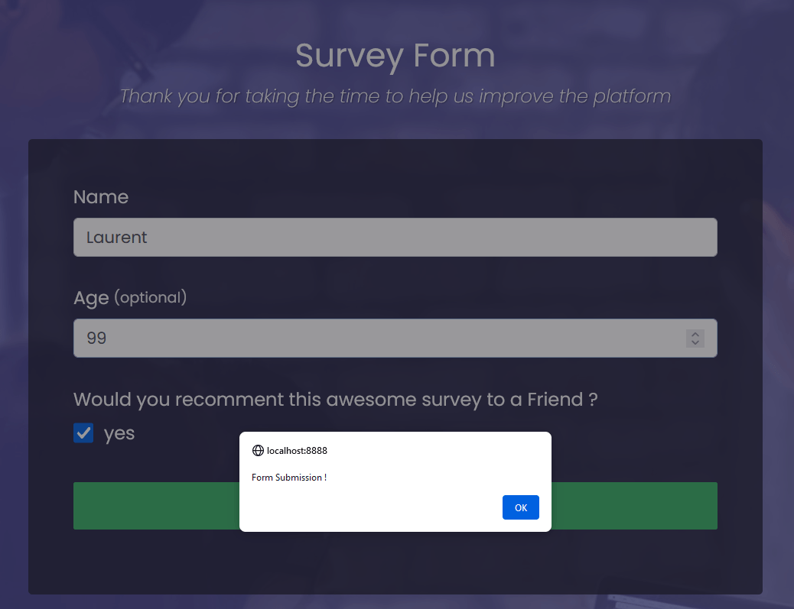

Now that we have something happening when a user submit the form, let's go a bit further. We want to look at the content of the form and make sure we can get the right data in JSON. We want a String for the name, and Integer for the age and a boolean for the recommandation.

And it turns out that the HTML checkbox is not playing nice. The value it gives by default is no value, and once checked it gives the content of the value field. We are going to add another input field, hidden, to make sure the default value will be False.
```html
          <label>
            <input
              id="hiddenRecommend"
              name="recommend"
              value="false"
              type="hidden"
            />
            <input
              id="recommend"
              name="recommend"
              value="true"
              type="checkbox"
              class="input-checkbox"
            />yes</label>
```

Now about the Javascript Code, the are some interesting new lines to look into.

```Javascript
  const form = document.getElementById('survey-form');
  form.addEventListener('submit', handleForm);

  async function handleForm(e) { <1>
    e.preventDefault()
    
    const data = new FormData(e.target); <1>
    const value = Object.fromEntries(data.entries()); <2>
    const details = `name: ${value.name}\nage: ${value.age}\nrecommend: ${value.recommend}`; <3>
    console.log(details); <4>
  }
```
  <1> The parameter of the handleForm function is an object(e) with a field called target. This target can be transform into a FormData object.
  <2> The FormData object can be transformed into a JSON object.
  <3> Now that we have a JSON object we can print out the values we are interested in.
  <4> This time instead of displaying an alert box, we are logging the details string to the console. The console can be accessed through your browser's dev tools. It is great for debugging.

With that being sorted, let's get serious and start creating a Netlify function. Enter `netlify function:create` in your terminal. You should see something like
```
[C:\Code\Couchbase\myproject] $ netlify function:create
? Select the type of function you'd like to create Serverless function (Node/Go)
◈ functions directory not specified in netlify.toml or UI settings
? Enter the path, relative to your site’s base directory in your repository, where your functions should live: netlify/functions
◈ updating site settings with netlify/functions
◈ functions directory netlify/functions updated in site settings
◈ functions directory netlify/functions does not exist yet, creating it...
◈ functions directory netlify/functions created
? Select the language of your function JavaScript
? Pick a template javascript-hello-world
? Name your function: saveform
◈ Creating function saveform
◈ Created netlify\functions\saveform\saveform.js
[C:\Code\Couchbase\myproject] $ 
```

Select Serverless function, leaves the default for the next question about path, keep Javascript as the language, keep the default hello-world template, than give a name to your function. Mine is called `saveform`. This will generates new files in the netlify folder. If you run `netlify dev` now, you will see new lines the logs:
 ```
 Loaded function saveform http://localhost:8888/.netlify/functions/saveform.
◈ Functions server is listening on 62431
```
This means that our netlify dev server is also serving our newly created function. Take a look at the newly generated file `./netlify/functions/saveform/saveform.js`.

```javascript
// Docs on event and context https://docs.netlify.com/functions/build/#code-your-function-2
const handler = async (event) => { <1>
  try {
    const subject = event.queryStringParameters.name || 'World' <2>
    return {
      statusCode: 200,
      body: JSON.stringify({ message: `Hello ${subject}` }), <3>
      // // more keys you can return:
      // headers: { "headerName": "headerValue", ... },
      // isBase64Encoded: true,
    }
  } catch (error) {
    return { statusCode: 500, body: error.toString() } <4>
  }
}

module.exports = { handler }
```

  <1> the signature of the function is aysynchronous (the async keyword),and has an event parameter. Asynchronous means some code inside the function can be asynchronous and we can wait for the code to be executed with the await keyword, instead of managing the JavaScript Promess object traditionally returned by async functions.
  <2> the `event` object has some properties and methods, like `queryStringParameters` that allows us to get the name query param
  <3> this function must return a JSON object with an HTTP status code and an Object body. If everything worked well, we return a JSON body containing a message field and the code 200. Code starting with 2 means things went well.
  <4> If things went wrong, we return the status code 500. Code starting with 5 means something went wrong on the server. And the body field will contain the error.

 Let's try it out by calling this function when the user clicks on submit. Just add the following code after the last console.log call:

```Javascript
    console.log(details);

    const response = await fetch("/.netlify/functions/saveform", { <1>
      method: 'GET', <2>
      headers: { <3>
          'Content-Type': 'application/json',
        },
    })
    if (response.status == 200) { <4>
      console.log(await response.text());
    }
```

  <1> fetch is the method you can call to send an HTTP request to a server. Here we are sending a request to `/.netlify/functions/saveform`. Notice the await keyword that means this method usually returns a promess. Here we are just assign the result of the promess to the field response.
  <2> HTTP request have methods, sometime also known as HTTP verbs. Here we are not modifying anything on the server, we are retrieving information, so we are using the method GET
  <3> HTTP requests have [headers](https://developer.mozilla.org/en-US/docs/Web/HTTP/Headers/Content-Type). They provide additional metadata like the Content-type, here set to `application/json`. What it means is that we are manipulating JSON. `application/text` would mean we are manipulating any form of text. These are called [Mime types or Media type](https://developer.mozilla.org/en-US/docs/Glossary/MIME_type).
  <4> We are testing the status code returned by the server. If it's 200, it means everything went well. We have a message to display in the console.

Add, commit and push. `netlify open:admin`
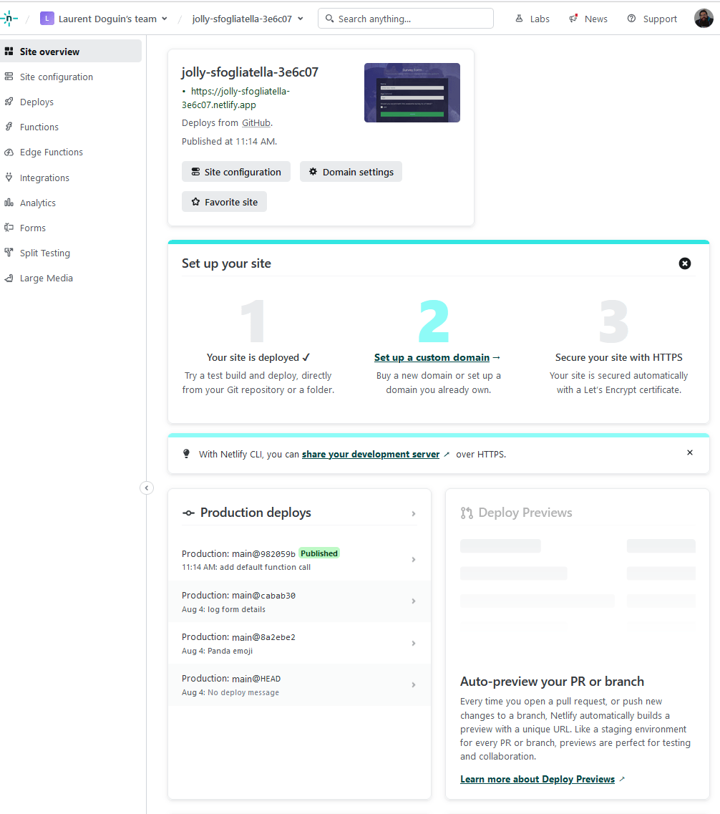

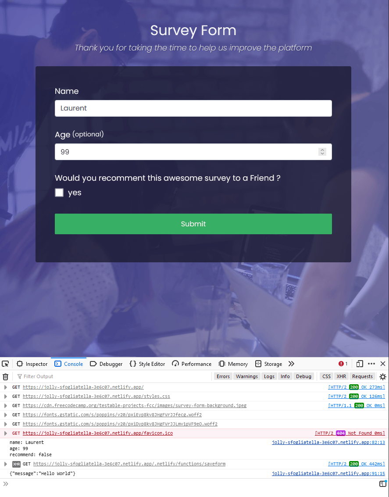

At this point, you have a frontend and a backend deployed, on Internet. But all we are doing is calling the default function created by Netlify's wizard. The next step is to send the content of the form to that function, and store is in a database.

## Step 4 - Database

First thing to do is figure out how to send the form details to the function. This requires us to change our GET method to a POST method. These things are called HTTP request methods, sometimes reffered to as HTTP verbs. You can take a look at the full list on [MDN](https://developer.mozilla.org/en-US/docs/Web/HTTP/Methods). A Get method request is used to only retrieve data. A post method request is used to create or change data. This is exactly what we want. We want to create a new entry in our Dababase when someone submits a form. An HTTP request has a method, some headers(Metadata about your requests, here we are saying the request will be JSON content with the Content-Typ header), and a body. The body of our request will be JSON text.

```Javascript
    const response = await fetch("/.netlify/functions/saveform", {
      method: 'POST', <1>
      headers: {
          'Content-Type': 'application/json',
        },
        body: JSON.stringify(value), <2>
    })
```
  <1> We change the HTTP method to POST because we want to change something instead of just retrieving information.
  <2> A request can also have a body. Here we are sending a text version of our JSON object.

Our frontend HTTP request to our backend is changed, now we need to adapt the backend code.

```Javascript
const handler = async (event) => {
  try {
    var data = JSON.parse(event.body); <1>
    return {
      statusCode: 200,
      body: JSON.stringify({ name: data.name }) <2>
    }
  } catch (error) {
    return { statusCode: 500, body: error.toString() }
  }
}

module.exports = { handler }
```
  <1> The event object allows us to get the body of the request. It's text, we can parse this text into a JSON object and assign it to the field called `data`.
  <2> To make sure we did receive our JSON object, we change the returned message and use the field `data.name`. 

You should see a different message in the web dev console, you should see `{"name":"yourName"}`.

We have send the form data to the backend and made sure of it. Now on to the Database side of things. Working at Couchbase, this is the database I am going to use. A simple way to try, go to [https://cloud.couchbase.com/sign-up](https://cloud.couchbase.com/sign-up), create an account, you get a 30 days trial, no credit card required.

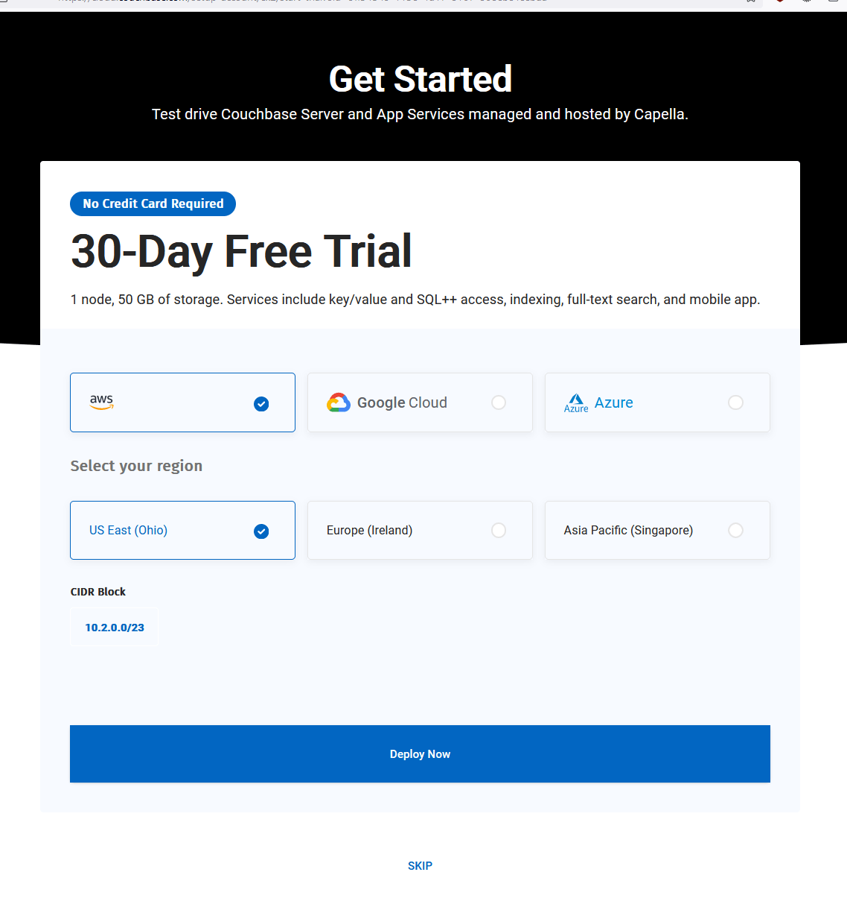

You can leave the default on, or choose your favorite cloud provider and closest region. Click on *Deploy now* and wait for the deployment of your database. 
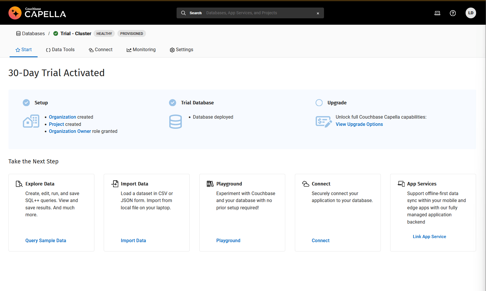

Two things we want to do from there. Make sure we can connect to that database from our backend code, and make sure we can write the data somewhere. Go ahead and click the Connect tab. 

In Couchbase we store data in Buckets. By default the trial comes with a travel-sample bucket preimported. We are not going to use it. Instead we are going to create our own bucket. Click on *Settings* on the top level menu, than on *Buckets* on the left menu.

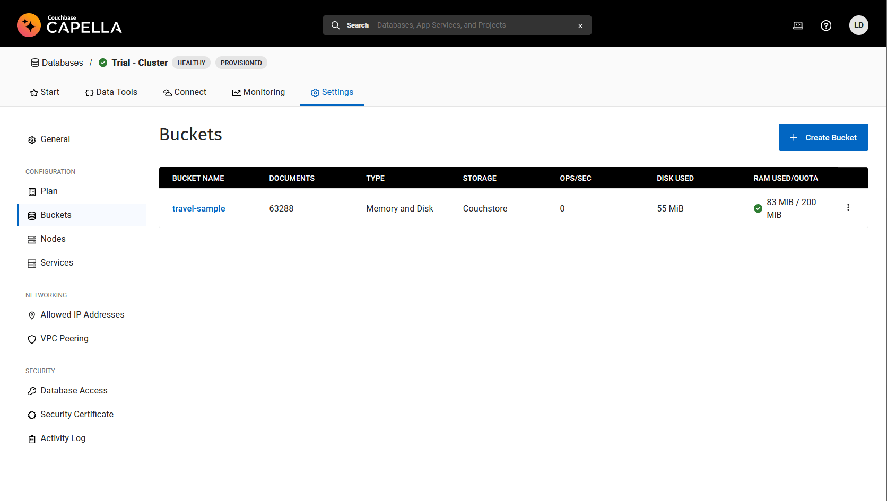

Now click on *+ Create Bucket*, give it a name and leave the rest to default settings.Than Click on *Create Bucket*.

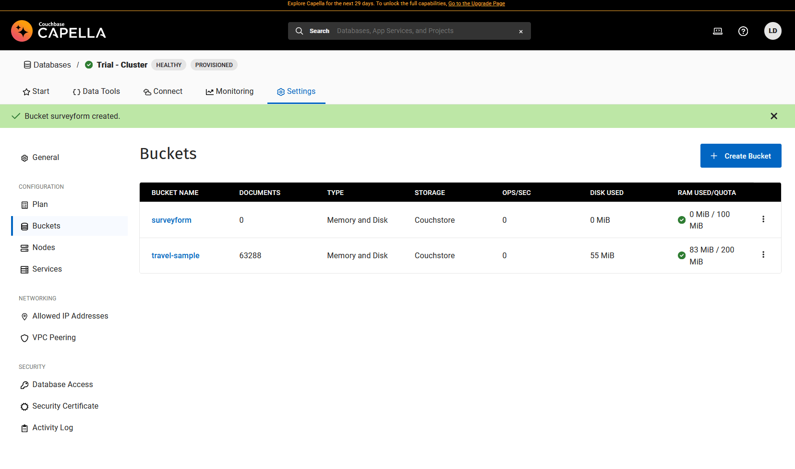

We have a new Bucket, now we need to create associated credentials. Click the *Database Access* button, than *Create Database Access* button.

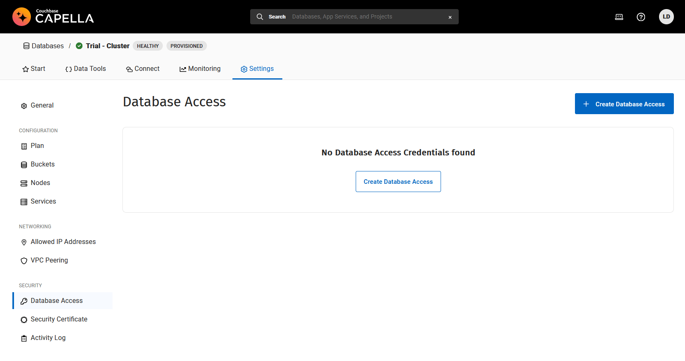

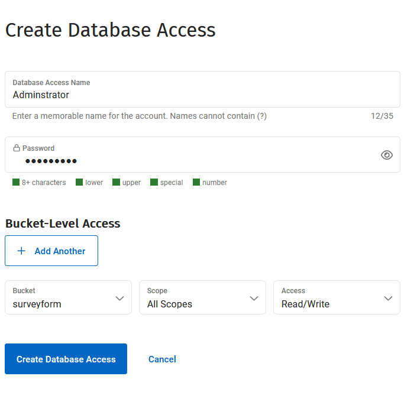

Make sure you remember both username and passaord and click on *Create Database*. One last thing to do is to allow this database to be reachable publicly. Right now it's hidden. Click on *Allowed IP Addresses*, than *Add Allowed IP*. Click on *Allow Access from Anywhere*, follow the instructions. This should prefill the form, than click on the *Add Allowed IP* button. You might think this is a bit cumbersome. Why isn't it the default?

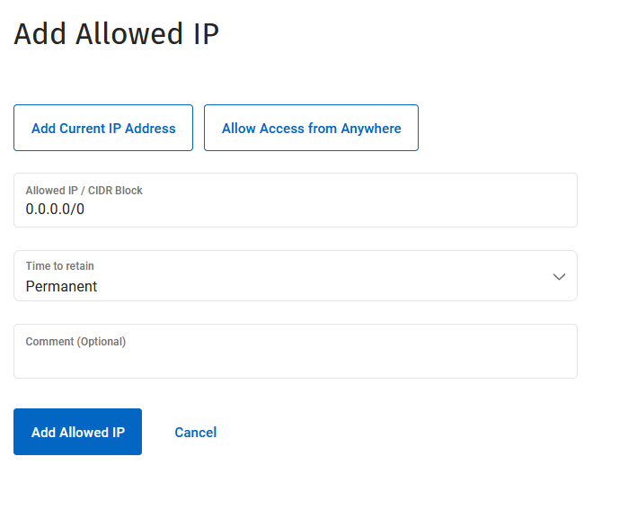
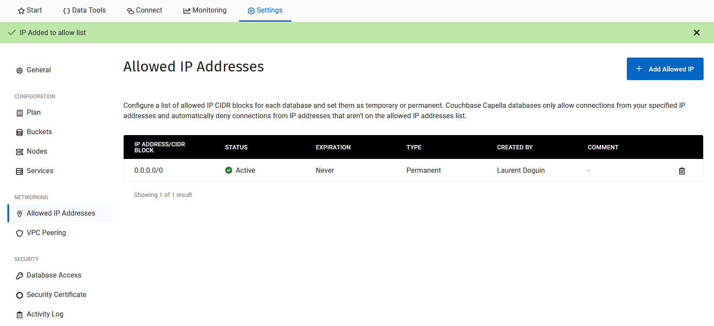

Now click on the *Connect* tab. You will see the connection String, select your database credentials, switch the language to Node, and it will five us the right instructions to connect to the database from our backend code.
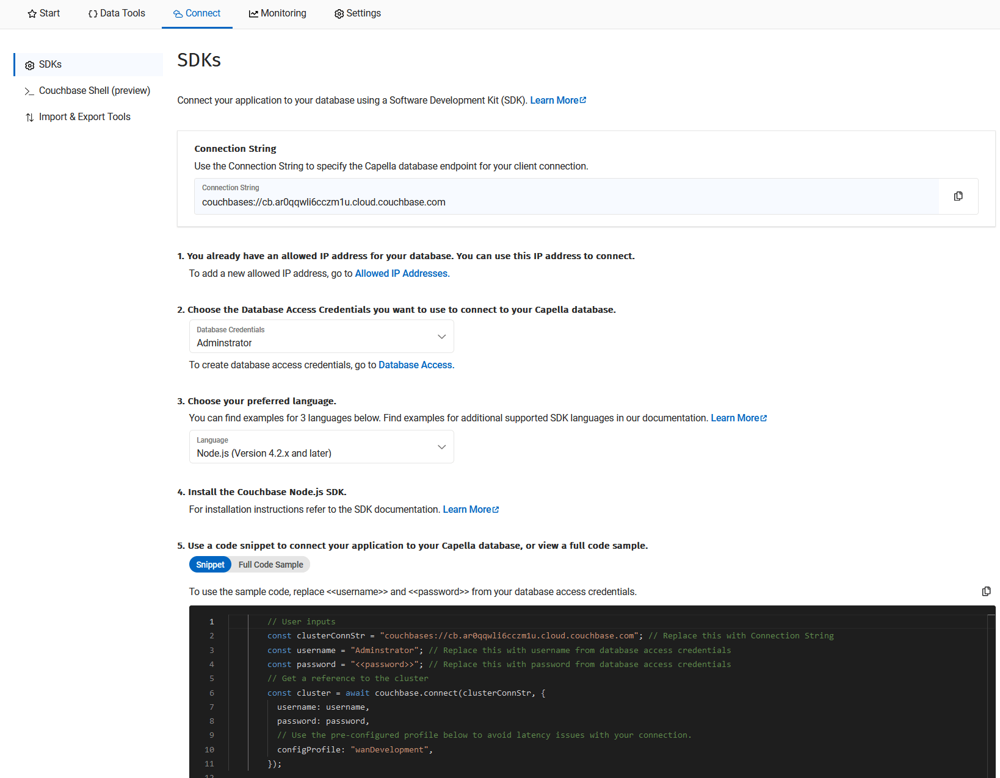

We can copy and paste this to our function code, and add a couple more things.

```Javascript
const crypto = require("crypto"); <1> 
const couchbase = require("couchbase"); <2>

const handler = async (event) => {
  try {
		const clusterConnStr = "couchbases://cb.ar0qqwli6cczm1u.cloud.couchbase.com"; // Replace this with Connection String <3>
		const username = "Adminstrator"; // Replace this with username from database access credentials <3>
		const password = "Couch#123"; // Replace this with password from database access credentials <3>
		// Get a reference to the cluster
		const cluster = await couchbase.connect(clusterConnStr, { <4>
		  username: username,
		  password: password,
		  // Use the pre-configured profile below to avoid latency issues with your connection.
		  configProfile: "wanDevelopment",
		});
    const bucket = cluster.bucket("surveyform"); <5>
    const collection = bucket.defaultCollection(); <6>

    var data = JSON.parse(event.body);
    let result = await collection.insert(crypto.randomUUID(), data); <7>
    
    return {
      statusCode: 200,
      body: JSON.stringify({ name: data.name })
    }
  } catch (error) {
    console.log(error);
    return { statusCode: 500, body: error.toString() }
  }
}

module.exports = { handler }

```

  <1> You can see we have two new dependencies to our project. The 'crypto' package is provided by node. It allows us to generate a random identifier for our document
  <2> The 'couchbase' package is the Couchbase NodeJS SDK. It's every bit of code you need to connect to a Couchbase database. This projects are also often called drivers for other databases, or clients.
  
For Couchbase you need to install it. Running `npm i couchbase@4.2.4` will do the trick. Right now Netlify/Couchbase compatibilty is assured for Couchbase version 4.2.4 or bellow. This is due to the nature of our SDK. It's a JavaScript interface on top our our C SDK. And C dependencies expect to find their system dependencies in the right version. Right now Couchbase 4.2.5 is expecting to find GLIBC_29 but it's not available on the Ubuntu system running our Netlify backend code.

Now that we have dependencies, let's be explicit in how build them. You can add a `netlify.toml` file at the root of the repository with the following content:

```toml
[build]
  command = "npm install && strip --strip-debug ./node_modules/couchbase/build/Release/couchbase_impl.node"
  publish = "."
```
It's doing a couple things. Installing the dependencies and removing the debug symbol table from `couchbase_impl.node`. This file is the C library used by our Node SDK. And it's too big for Netlify right now. So we are removing unnecessary clutter coming from the build process.

  <3> This variables are the informations needed for the SDK to connect to the cluster. A connections string, a username and a password.
  <4> `couchbase.connect` takes the connection string as first parameter, than a JSON object with username, password and other options. Here we also give the `wanDevelopment` config profiles. It will increase the default timeout values of all Couchbase operations. Basically if your connection is slow it won't scream at you.
  <5> From the Cluster object we get a Bucket. A bucket is where we store Scopes and Collections. Here we get the `surveyform` bucket. It already has a default scope and a default collection.
  <6> From the bucket we can get the default Collection. A Collection is where we store Document, or key/value pairs. Think of the key as the identifier of the document, and the value as your JSON data. But it could be anything else.
  <7> From the collection object, we call the insert method. It takes two parameters, the key and the value. So we call the randomUUID() method from the crypto package, to generate a random identifier. And we pass the data object as value. It contains our JSON. This function is asynchronous, it's making a request to the Couchbase Capella cluster. We await for the cluster's response.

Now you could add the new files, commit and push to Github. But that would push your password to Github. We don't want that. Instead you can test it by running `netlify dev`. Go ahead and resubmit the form.

If everything went well, you have written data to your Database! You can check this out easily by going to the Couchbase Capella UI. Cick on *Data Tools*, select your Bucket, Scope and collection, and you should see your survey from document.


This is great, you just wrote code to your database !

## Step 5 - Configuration Management

To avoid pushing our credentials on Github, we are going to use environment variables. Environment variables are common to every Operating Systems and is the best way to manage configuration across different environments(Different OSs, clouds, test, staging, preproduction, production, whatever fits your workflow).

```
....
const ENDPOINT = process.env.COUCHBASE_ENDPOINT || "couchbase://localhost"; <1>
const USERNAME = process.env.COUCHBASE_USERNAME || "Administrator";<1>
const PASSWORD = process.env.COUCHBASE_PASSWORD || "password";<1>
const BUCKET = process.env.COUCHBASE_BUCKET || "surveyform"<1>

const handler = async (event) => {
  try {
		const clusterConnStr = ENDPOINT; // Replace this with Connection String
		const username = USERNAME; // Replace this with username from database access credentials
		const password = PASSWORD; // Replace this with password from database access credentials
		// Get a reference to the cluster
		const cluster = await couchbase.connect(clusterConnStr, {
		  username: username,
		  password: password,
		  // Use the pre-configured profile below to avoid latency issues with your connection.
		  configProfile: "wanDevelopment",
		});
    const bucket = cluster.bucket(BUCKET);
...
```
  <1> The process object is always available with node so no need for a specific library import. Using _||_ allows to provide a default value for each variable if they are not defined.

On Mac or Linux, you can run `export MYVARIABLE="value"` in your terminal. On Windows you can run `$Env:MYVARIABLE="value"`

To define them in Netlify's context, you can go though the UI and do it manually, or use the CLI:
```
netlify env:set COUCHBASE_ENDPOINT couchbases://cb.ar0qqwli6cczm1u.cloud.couchbase.com
netlify env:set COUCHBASE_USERNAME Administrator
netlify env:set COUCHBASE_PASSWORD password
netlify env:set COUCHBASE_BUCKET surveyform
```

Now you can add your files, commit and push your code. Congratulations, you went fullstack. Backend, Frontend and Database. And deployed everything live! But our work is not over. There are still a couple things we can do to make this more professional.


## Step 6 - User feedback

Right now we don't have much happening when the user clicks on the *Submit* button of our form. We need to change this to let them know they have been successfully recored, or not. First step it check for an error on the dev side of things. HTTP status code are well made, anything equals or higher than 400 is usually an error, so we can do something like this:

```Javascript
    
    if (response.status >= 400) { <1>
      console.log("Something when wrong"); <2>
      console.log(await response.text()); <3>
      return false;
    }
```

  <1> Status code that starts with 4 usually means something went wrong on the client side. The wrong data was sent, the client does not have the right permission, the page does not exist etc... Here we test if the code is equals or higher than 400.
  <2> If it is, we log a message in the console
  <3> We also log the error message returned by the server


To test it, just make a typo somewhere in your Connection String or Credentials to Couchnase. You should see errors in the webconsole once clicking on *Submit*. But the web console is just for us, we need to add a proper error or success message to our user.

I added a couple span HTML elements with error and success message right before the end of the form. Note the hide CSS class that makes them invisible for now.
```html
...
        </div>
        <span id="form-error" class="error-message hide"></span>
        <span id="thank-you-message" class="hide">
          Your participation has been recorded, thank you!.
        </span>
      </form>
...
```

And here is the corresponding CSS. Displaying the error in red, hiding or showing an element, and a nice fade-out animation because I am fancy like that.

```css
.container .error-message {
  color: red;
}

.hide {
  display: none;
}
.show {
  display: block;
}

.fade-out {
  animation: fadeOut ease 8s;
  -webkit-animation: fadeOut ease 8s;
  -moz-animation: fadeOut ease 8s;
  -o-animation: fadeOut ease 8s;
  -ms-animation: fadeOut ease 8s;
}@keyframes fadeOut {
  0% {
    opacity:1;
  }
  100% {
    opacity:0;
  }
}

@-moz-keyframes fadeOut {
  0% {
    opacity:1;
  }
  100% {
    opacity:0;
  }
}

@-webkit-keyframes fadeOut {
  0% {
    opacity:1;
  }
  100% {
    opacity:0;
  }
}

@-o-keyframes fadeOut {
  0% {
    opacity:1;
  }
  100% {
    opacity:0;
  }
}

@-ms-keyframes fadeOut {
  0% {
    opacity:1;
  }
  100% {
    opacity:0;
    display: none;
}
```

Now to put everything together. The first two lines get the new span elements just added. the call to `form.reset()` is clearing all values from the form when the returned response status code is 200. Than the rest is playing with CSS classes to make the message appear, than fading out with the addition of the fade-out class, than a 7000ms timeout function will remove every classes and hide the element again. It's pretty much the same when there is an error.

```Javascript

    const thankYouMessage = document.getElementById('thank-you-message'); <1>
    const formError = document.getElementById("form-error"); <1>

    if (response.status == 200) {
      form.reset(); <2>
      thankYouMessage.classList.add('show'); <3>
      thankYouMessage.classList.add('fade-out'); <3>
      setTimeout(function(){thankYouMessage.classList.remove('fade-out');thankYouMessage.classList.remove('show');}, 7000); <3>
      console.log(await response.text());
      return false;
    }
    
    if (response.status >= 400) {
      console.log("Something when wrong");
      console.log(await response.text());
      formError.textContent = "Something went wrong while recording your contact."; <4>
      formError.classList.toggle('show'); <4>
      formError.classList.toggle('fade-out'); <4>
      setTimeout(function(){formError.classList.toggle('fade-out');formError.classList.toggle('show');}, 7000); <4>
      return false;
    }
```

  <1> We assign our new spans to variables
  <2> If things went well, we reset the form's data, it shows to the user that it worked.
  <3> We first add a CSS class that shows the error message, than apply the fade-out CSS class, than call the timeout function. In 7000 ms, the fade-out and show CSS class will be removed, hiding the success message again.
  <4> We do the same thing when there is an error, using the formError HTML element instead.

Now you can test submit a form again and see the different success or error message, depending on what you decided to do. When you are happy you can add, commit and push that code. 

Congratulations, you made it to the end of this guide ! You have used git, Github, Netlify and Couchbase Capella to deploy an HTML form on the web, and make sure that the content was stored in a database each time users sould submit the form.