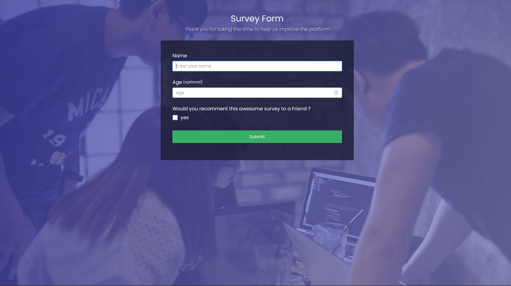
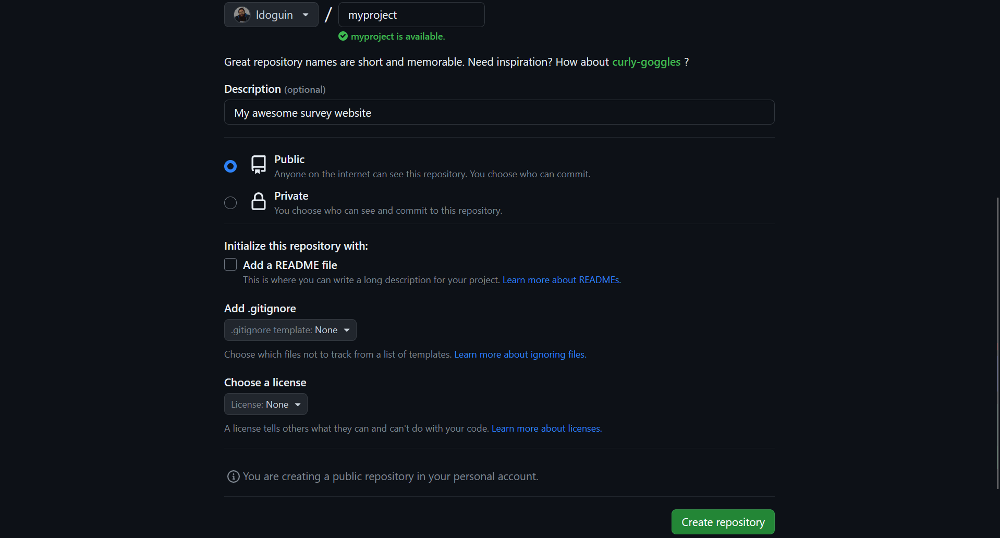
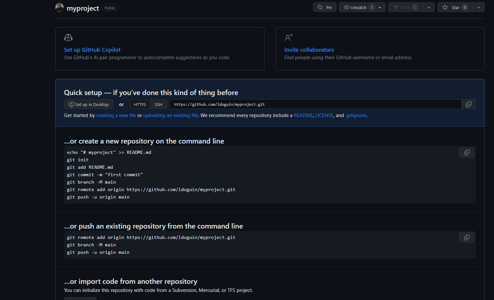
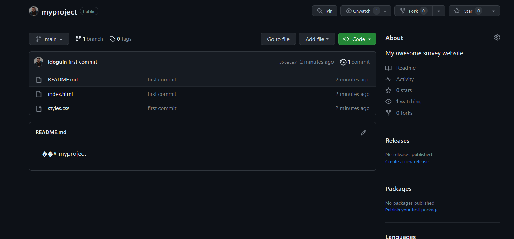
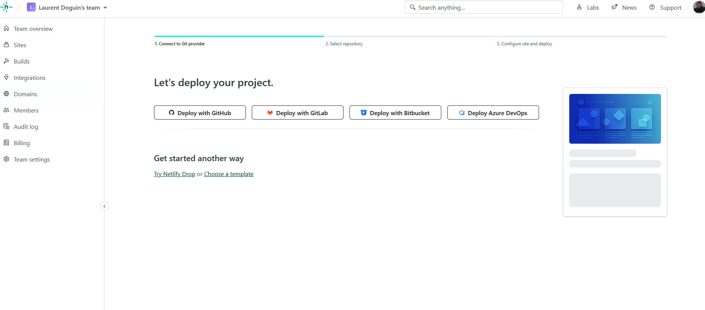
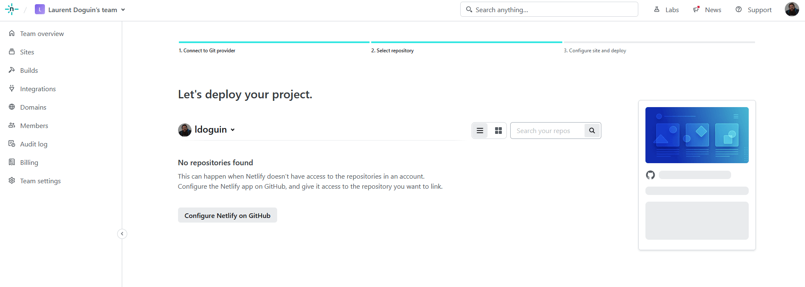
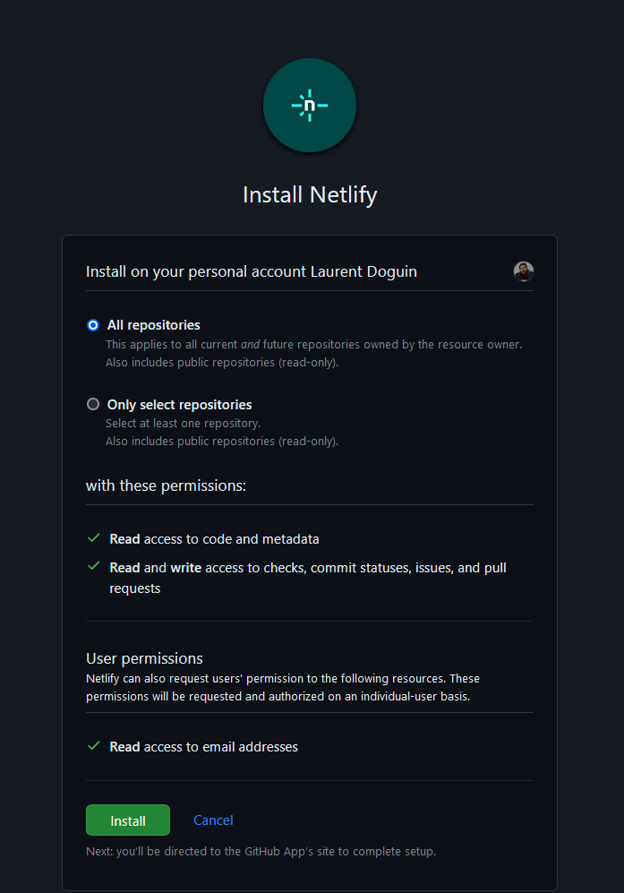
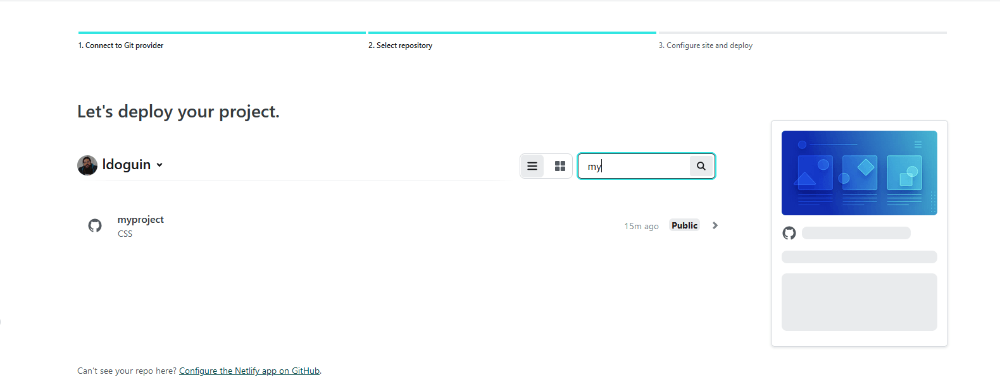
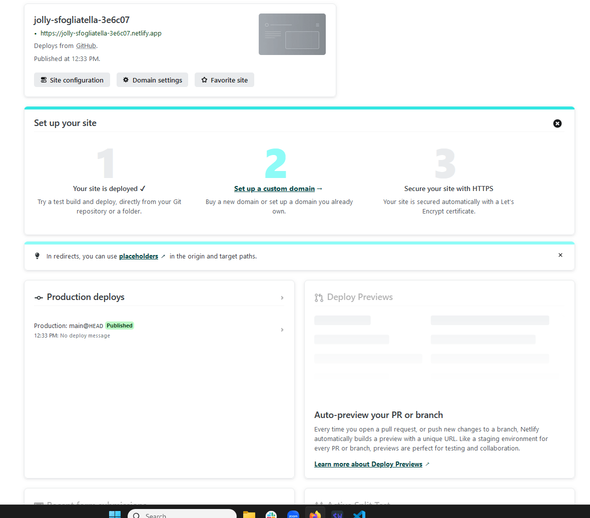

# freecodecamp-survey

Step by Step minimal FreeCodeCamp Survey database tutorial. What happens after you have completed https://www.freecodecamp.org/learn/2022/responsive-web-design/build-a-survey-form-project/build-a-survey-form ?

# Step 1 - Create an HTML Form

Getting a lot of inspiration from the FreeCodeCamp survey example(Copy, paste, and trim), I get the following HTML form.

```html
<!DOCTYPE html>
<html>
  <head>
    <link rel="stylesheet" href="./styles.css" />
  </head>
  <body>
    <div class="container">
      <header class="header">
        <h1 id="title" class="text-center">Survey Form</h1>
        <p id="description" class="description text-center">
          Thank you for taking the time to help us improve the platform
        </p>
      </header>
      <form id="survey-form">
        <div class="form-group">
          <label id="name-label" for="name">Name</label>
          <input
            type="text"
            name="name"
            id="name"
            class="form-control"
            placeholder="Enter your name"
            required
          />
        </div>
        <div class="form-group">
          <label id="number-label" for="number"
            >Age<span class="clue">(optional)</span></label
          >
          <input
            type="number"
            name="age"
            id="number"
            min="10"
            max="99"
            class="form-control"
            placeholder="Age"
          />
        </div>

        <div class="form-group">
          <p>
            Would you recomment this awesome survey to a Friend ?
          </p>

          <label
            ><input
              name="recommend"
              value="recommend"
              type="checkbox"
              class="input-checkbox"
            />yes</label
          >
        </div>

        <div class="form-group">
          <button type="submit" id="submit" class="submit-button">
            Submit
          </button>
        </div>
      </form>
    </div>
  </body>
</html>
```

The styles.css file is exactly the same. To test it you can go in your browser and select file, open, than select index.html. Take a look at your browser URL, it shows a path to a local file. And you should see somehting like this, that does not do anything when you click on submit.



The question then is, how do we deploy it to a website, how do we make it do something ? We need some backend code to be executef after the click. And then make that code store the from content in a database. 

# Step 2 - Netlify

Let's start by deploying this form live on the Internet. To that end we are going to use Netlify. First thing first, making sure that we have the Netlify CLI available, and that we are logged in.

Typing `netlify version` in my terminal currently gives me `netlify-cli/15.6.0 win32-x64 node-v18.5.0`. So I know it's installed and ready.

If it's not installed, the fastest route is to type `npm install netlify-cli -g` in your terminal. You wil find more details on [https://docs.netlify.com/cli/get-started/](https://docs.netlify.com/cli/get-started/).

Then the next thing to do is type `netlify login` in your terminal. It will take you through the Netflify sign in form.

Now everything should be ready to move to the deployment phase. But just to make sure we are going to test things locally. Because that's what most developers do. To that end, type `netlify dev` in your terminal.

It should output the following in your terminal and open your form in your browser. 
```
◈ Netlify Dev ◈
◈ Ignored general context env var: LANG (defined in process)
◈ No app server detected. Using simple static server
◈ Unable to determine public folder to serve files from. Using current working directory
◈ Setup a netlify.toml file with a [dev] section to specify your dev server settings.
◈ See docs at: https://cli.netlify.com/netlify-dev#project-detection
◈ Running static server from "freecodecamp-survey"
◈ Setting up local development server

◈ Static server listening to 3999

Adding local .netlify folder to .gitignore file...

   ┌─────────────────────────────────────────────────┐
   │                                                 │
   │   ◈ Server now ready on http://localhost:8888   │
   │                                                 │
   └─────────────────────────────────────────────────┘
```

If you take a look at the browser URL bar again, you will see that it is different. It looks like a webite address, not a local file. Congratulations, you just run your first local server, serving your html and css file, using `netlify dev`! You have a website running on your machine. Now let's make this accessible to everyone on Internet. Both the source code and the site itself.

Go to Github(or Gitlab, or Heptaod, or any other code source hosting solutions, there are others out there !) and create a new Repository. Visit https://github.com/new for Github. You are now in the repo wizard creation. I have only setup my organization, my repo name and a description than clicked on the *Create Repository* button.





It will give you all the instructions needed to convert your working folder in a git repo, and link it to your github project. This is what I typed in my terminal:


```bash
echo "# myproject" >> README.md
git init
git add README.md
git commit -m "first commit"
git branch -M main
git remote add origin https://github.com/ldoguin/myproject.git
git push -u origin main
```

This is the resulting terminal output:
```
[C:\Users\Laurent Doguin\Documents\Couchbase\myproject] $ echo "# myproject" >> README.md
[C:\Users\Laurent Doguin\Documents\Couchbase\myproject] $ ls


    Directory: C:\Users\Laurent Doguin\Documents\Couchbase\myproject


Mode                 LastWriteTime         Length Name
----                 -------------         ------ ----
-a----          8/4/2023  12:11 PM             28 README.md


[C:\Users\Laurent Doguin\Documents\Couchbase\myproject] $ git init
hint: Using 'master' as the name for the initial branch. This default branch name
hint: is subject to change. To configure the initial branch name to use in all
hint: of your new repositories, which will suppress this warning, call:
hint:
hint:   git config --global init.defaultBranch <name>
hint:
hint: Names commonly chosen instead of 'master' are 'main', 'trunk' and
hint: 'development'. The just-created branch can be renamed via this command:
hint:
hint:   git branch -m <name>
Initialized empty Git repository in C:/Users/Laurent Doguin/Documents/Couchbase/myproject/.git/
[C:\Users\Laurent Doguin\Documents\Couchbase\myproject] $ git config --global init.defaultBranch main
[C:\Users\Laurent Doguin\Documents\Couchbase\myproject] $ git branch -m main
[C:\Users\Laurent Doguin\Documents\Couchbase\myproject] $ git add .\README.md .\index.html .\styles.css
[C:\Users\Laurent Doguin\Documents\Couchbase\myproject] $ git commit -m "first commit"
[main (root-commit) 356ece7] first commit
 3 files changed, 245 insertions(+)
 create mode 100644 README.md
 create mode 100644 index.html
 create mode 100644 styles.css
[C:\Users\Laurent Doguin\Documents\Couchbase\myproject] $ git remote add origin https://github.com/ldoguin/myproject.git
[C:\Users\Laurent Doguin\Documents\Couchbase\myproject] $ git push -u origin main
Enumerating objects: 5, done.
Counting objects: 100% (5/5), done.
Delta compression using up to 8 threads
Compressing objects: 100% (4/4), done.
Writing objects: 100% (5/5), 1.95 KiB | 999.00 KiB/s, done.
Total 5 (delta 0), reused 0 (delta 0), pack-reused 0
To https://github.com/ldoguin/myproject.git
 * [new branch]      main -> main
branch 'main' set up to track 'origin/main'.
[C:\Users\Laurent Doguin\Documents\Couchbase\myproject] $
```

Now if I go back to the Github page and reload it, this what I see: 


Congratulations, your code is now available on Github, for everyone to see, learn from, contribute to. It's now time for Production! Let's make that website live 💪 

 Go ahead and visit https://app.netlify.com/start/deploy. This will get you to Netify's new project wizzard. You will see various buttons to help you start, Github, Gitlab, Bitbucket, AzureDevops. Let's click on Github.
 

You will see a couple windows asking you to link your Github profile to Netlify. Go ahead and proceed, it will take you to the following age. 



Netlify is telling me I have no Netlify app installed on any Github org. Click on *Configure Netlify on Github*, it will open a poup window asking you to select the Github org you want to install Netlify in, and which repo to give it access to.



I leave the default and proceed to the next step. From now on you should see every repo in your Github account.



I will leave the default and click on *Deploy myproject*


You will see a link to your newly deployed on the internet website, for me it's `https://jolly-sfogliatella-3e6c07.netlify.app/`. Netlify provides sandboxes environment under the `netlify.app` domain for you to deploy things without having your own domain name.



Congratulatios, your website is now live on the Internet. Take a minute to celebrate 🎉.

